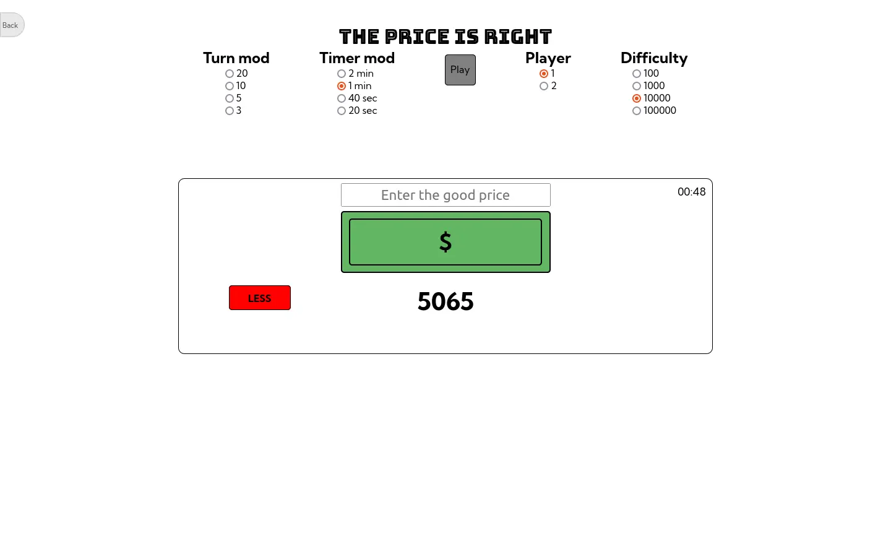

# Little Games 

Several small games coded in vanilla javascript.

[Live site](https://julabina.github.io/Littles_games/)

# Games 

- [Quizz](#quizz)
- [Shifumy](#shifumy)
- [The price is rigth](#the-price-is-rigth)
- [Yams](#yams)
- [Loto](#loto)
- [Connect 4](#connect-4)
- [Hangman](#hangman)
- [Memory game](#memory-game)
- [Fast fingers](#fast-fingers-test)

## Quizz

Simple quizz.

[Link](https://julabina.github.io/Littles_games/games/QUIZZ/index.html)

### Features

- Manipulate JSON data 

## Shifumy

V.2

Shifumy classic game.

[Link](https://julabina.github.io/Littles_games/games/SHIFUMI/index.html)

### Features

- Simple AI

## The price is rigth

The goal is to find the right number in the allotted time.

[Link](https://julabina.github.io/Littles_games/games/THE_PRICE_IS_RIGHT/index.html)

## Yams

Classic yahtze game.

[Link](https://julabina.github.io/Littles_games/games/YAMS/index.html)

## Loto

Simple loto game.

[Link](https://julabina.github.io/Littles_games/games/LOTO/index.html)

## Connect 4

Like the classic game connect 4 from Hasbro.

[Link](https://julabina.github.io/Littles_games/games/CONNECT4/index.html)

## Hangman

Classic hangman game.

[Link](https://julabina.github.io/Littles_games/games/PENDU/index.html)

### Features

- Multi language.

## Memory game

Simple memory game.

[Link](https://julabina.github.io/Littles_games/games/MEMORY/index.html)

## Fast fingers test

- Typing test.

[Link](https://julabina.github.io/Littles_games/games/FASTFINGERS/index.html)

### Feature 

- Multi language.